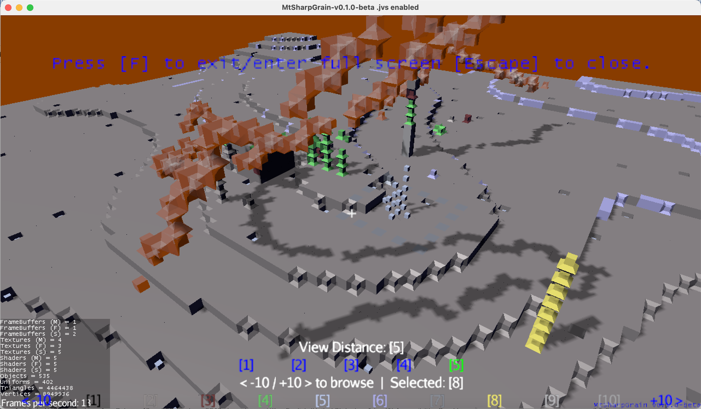
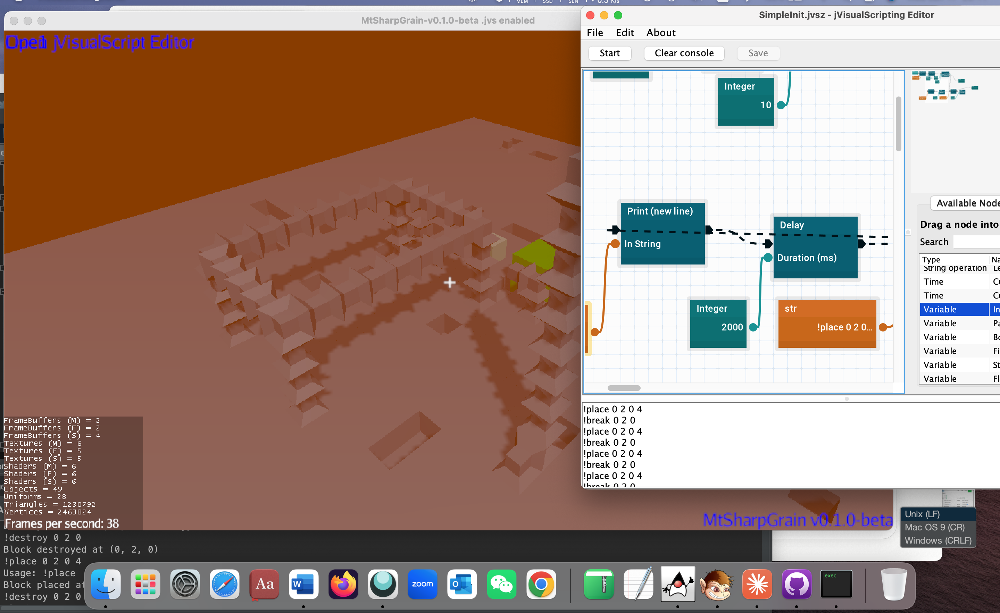
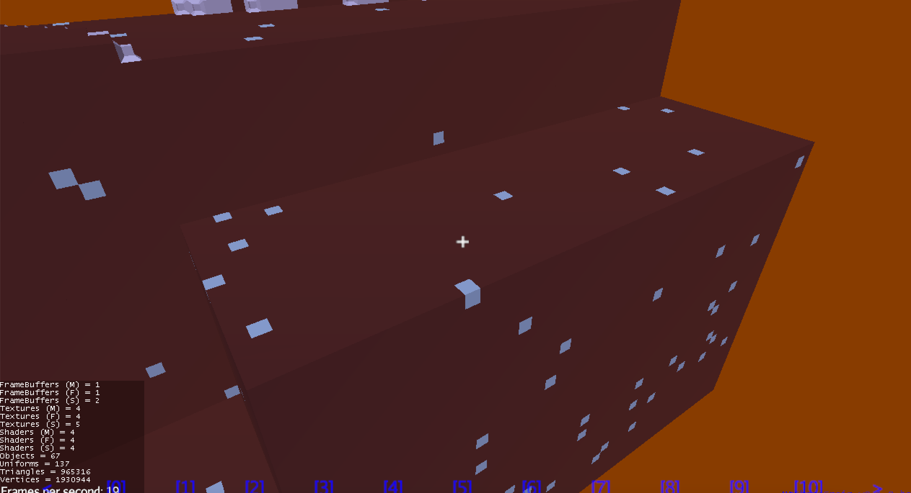
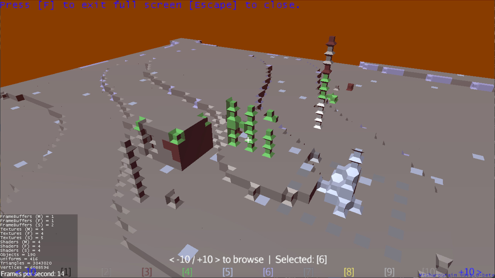
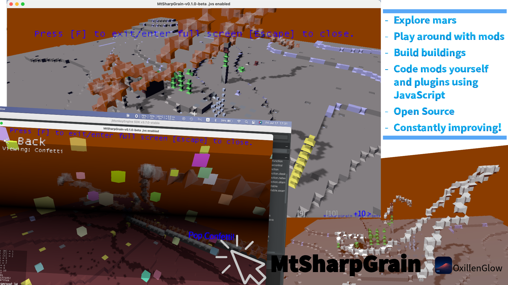
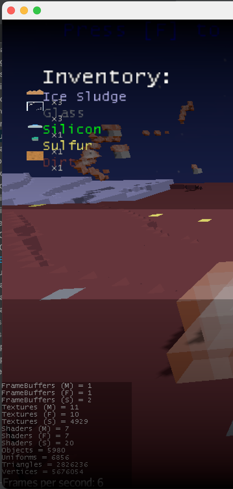
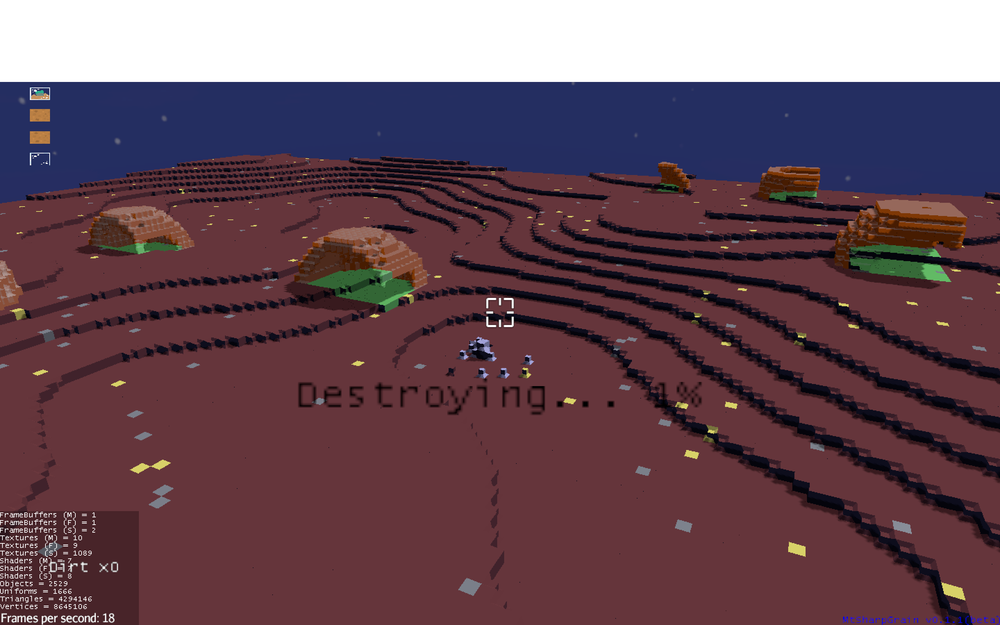

 

# MtSharpGrain 
 _<-- constantly improving!_

_If you don't see any comits in the last few days, I have been lazy._

A sand box, non voxel, highly modifiable game with slightly smooth interconnected blocks rather than traditional blocks. It is coded 100% in java (openGL lwjgl and jme).

---

### What's special?

#### Semi-smooth node meshes
blocks are connect with rounded transitions rather than hard cube edges
#### [JavaScript modifier system](https://github.com/OxillenGlow/MtSharpGrain/wiki/2.1-Code) 
Full powerful modding system to allow for JavaScript modding via GraalJS

You can control everything from player location to making new things floating around.
 
Why mods?
- I am a single person and do not have the resources to make a full game.
- I will **not** be able to make my game fit everyone's taste.

Modding solves both as **anyone including you!** can make *their own mini game* on top without messing with boring parts. This is more true with AI.

Like the idea? **[download now](https://github.com/OxillenGlow/MtSharpGrain/releases)** And go [here](https://github.com/OxillenGlow/MtSharpGrain/wiki/2.1-Code) to learn more on the modding system.

###### Console command system

`!place` / `!destroy` commands. In progress...

---

### [⬇️Download Now!](https://github.com/OxillenGlow/MtSharpGrain/releases)

available for MacOS, Windows, and Linux(Debian derived)

---

## Screen shots/Showcase

 Click here to see screen shots

Using jVisualScript to break and place blocks (too bad i did not do a GIF)

 
Just interesting to see how it is loading.

This is a picture the last version.

Dumb poster I made.

Currently the inventory bar looks like this

Small greenhouses with grass(edible? idk yet) inside.

---

### Links

- 📖 **[Wiki](https://github.com/OxillenGlow/MtSharpGrain/wiki)**
- 💬 **[Discussions](https://github.com/OxillenGlow/MtSharpGrain/discussions)**

---

### Special points

This is a project aimed at making a futuristic grided sanbox game using shaders, enviroment, and interconnected nodes. Of course, the current version falls short by a lot.

---

      m   m           s s s s            g g g
    m   m   m       s                  g
    m   m   m         s s s            g   g g g
    m       m               s          g       g
    m       m t     s s s s   harp       g g g   rain

---

### Important? stuff
#### What am i working on now?

> [!IMPORTANT]
> I am a bit tired already so i am going to make a publishable beta release before I finish the rest here.
>
> The biggest problem is to make the NPC stuff work with mods which will likely be 10x harder than the completed refactoring of mods. Im just going to make a tiny java class for a independent NPC mini system.

My todo/doing list:

 - The shaddow renderer is acting weird around blocks, most likely jMonkeyEngines fault, i should ask around
 - Make time be remembered in an xml
 - Add toggle for graphics (view distance, shaddows)(note to self, making dlsr shader more detailed is very computationally expensive)
 - Add an api for java controlled timed updating like JavaScript's setInterval. This will hopefully be able to replace engine "Update" flaggs and give modders more power whith better performance as it is done on mod thread.
    - Why not just setInterval? b/c setInterval is blocking on js side and java cant access afterwards making it really annoying.
 - NPC mod not spawning 40%
 - **Important** Randomly spawned buildings
    - Ground buildings 0/100
    - Air buildings 1/100 (want to help me add some buildings to the world? open a [discussion](https://github.com/OxillenGlow/MtSharpGrain/discussions)) on beta testing and game development.)
 - Npc with behavior > afterwards, scripts to control npc. 20%
 - Upgrade GUI... (constant)
 - Multi player support for mods (real multiplayer comes much later) 0%
 - Physics as java 0%
     - Fix collision stuff
     - Add a fall(acceleration) damage _mod_ (not that you can fall much in this game yet)
 - Fix buggs caused by refactoring to multi thread
     - Block placement. 90%
     - Other potential problems that i haven't found imidiately. 
 - After multithreading and decreasing amount of blocks drawn, Now i can increase renderdistance :D!!! kinda, chrome is CPU hungry and laggs my game.
Even my horible computer can run 5+ view distance easily!
 - Fix strange bug - chunks zipping around (can only be seen with window bug)
 - Fix window bug - not transparent but not, *not* transparent either. (i want to blame jmonkeyengine for this but i have to wait and see)

80% here means it is basically done but could be improved

Done:

 - Mod blocks with a Matrix API 70%
 - Minimize mod refresh rate to speed up main thread 90%
 - remove mod thread from main thread. 90% ?(This is a **big** refactoring and because I am bad at this stuff, I gave the work to replit agent, hopefully, it did its job well but idk commit: [328a...](https://github.com/OxillenGlow/MtSharpGrain/commit/328a0d94e4593c1bdab88822d84c2999c514918f) and [575e...](https://github.com/OxillenGlow/MtSharpGrain/commit/575e299de24305037bb86f87c4f3d860c8318754))
 - Add some random flux to terrain
 - Survival as a JavaScript mod 80%
 - Added skybox 70% - i need to refine skybox
 - Full screen ect 100%
 - Default JavaSctipt mods to be placed in assets and unpacked at runtime 90%
 - Used the java zip tool to allow for compressing chunks to much smaller sizes 80%
 - Extend JS API further
     - Simple save data api with XML 90%
     - Intermod communication API 100%
     - Utility constant display support for prefixing mods with:
         - LFT
         - RHT
         - BTM
         - to constantly display gui on left, right bottom of screen. 60%
 - JavaScript, to add some real and powerfull scripting (thanks a lot to claude)100%

### ⭐ [Other Projects ✨](https://github.com/OxillenGlow)
[My other projects](https://github.com/OxillenGlow)
### This project uses:

- **JavaMonkeyEngine** (and everthing that LWJGL has)
Website: https://www.jmonkeyengine.org
GitHub organization: https://github.com/jmonkeyengine

- **Riccardobl's simple IGui** for jme
GitHub source: https://github.com/riccardobl/jme-igui

- **Neuroph** for mlp (unused)
GitHub source: https://github.com/neuroph/NeurophFramework 

- **jVisualScripting** for visual scripts and engine (unused) see
GitHub source: https://github.com/openconcerto/jVisualScripting

- **GraalVM's community GraalJS** for the javascript modules
GitHub source: https://github.com/oracle/graaljs

- **Minkmin's HYPER Asset Pack** for some assets.
Available at: https://minkmin.itch.io/hyper-starter-pack

- **Kenney Assets** for great free CC0 assets
Available at: https://kenney.nl/assets

- **And much more who has made coding this easier for me and free**

#### AI?

Yes, I use claude a lot, perhaps too much? idk just speeds things up and removes need for constantly checking the API of whatever thing is implemented. Also, to be honest, Claude write code with less bugs and faster than me.

This is only for code, all assets/ideas are human made (not that i use a lot of assets).

---

The dumb section

empty...
