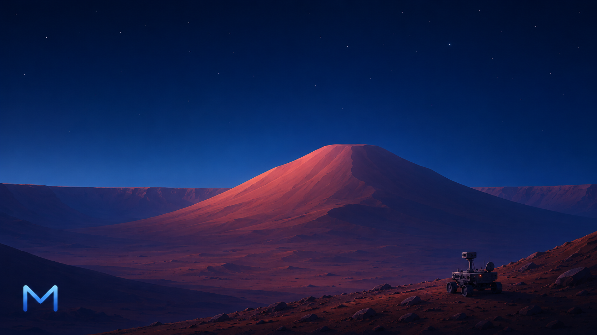
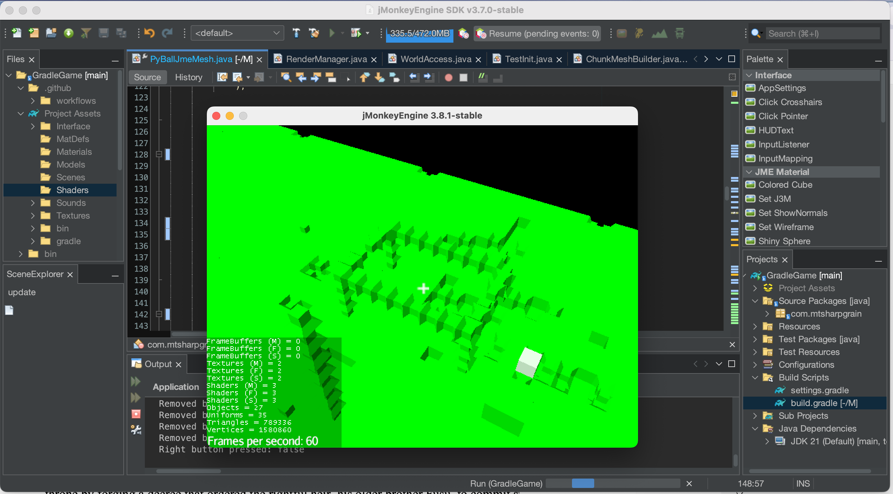

# MtSharpGrain 

######  ⬅️ please help increase 

A sand box, non voxel game with slightly smooth interconnected blocks.
## Link to [wiki](https://github.com/OxillenGlow/MtSharpGrain/wiki)
## Talk and ask, [discussions](https://github.com/OxillenGlow/MtSharpGrain/discussions)

## Special points

This is a project aimed at making a high graphic and, most importantly, realistic grided sanbox game using shaders, enviroment, and interconnected nodes. Of course, the current version falls short by a lot.

# Unimportant but important stuff?
## Soon to be implemented/fixed
- GUI > afterwards customisable with scripts
- Full screen ect
- Npc with behavior > afterwards, scripts to control npc 0%
- PBR, idk if it will actually make the game look "better" 0%
- Resolution management
- Scripts, jVisualScripting script engine would soon be added as a dependancy ✅ 20%
##### Finished but still needs fixing
- Faces, the are still facing the wrong sides ,  my code is now super messy :( ✅ 90%
## Goal
> i also hope that one day this can support scripts and mods in the future for easy modding.

> Multiplayer is also very important (Currently not implemented).
# ⭐ [Other Projects ✨](https://github.com/OxillenGlow)
[My other projects](https://github.com/OxillenGlow)
# Attribs

JavaMonkeyEngine (everthing that LWJGL has)
see > [website](https://www.jmonkeyengine.org)

AND

jVisualScripting (no other dependencies) see https://github.com/openconcerto/jVisualScripting for source

#### Screenshots

##### Dumb question, how many hashtags can you put here on GitHub for sections? Answer: 6.
this actually makes the text Gray instead of smaller compared to five hashtags while content stays the same. see ->
###### 6 hashtags 
[content]
